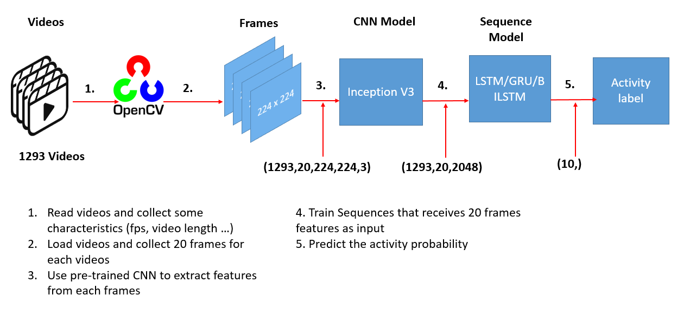

# Human Activity Recognition


## Project Intro
This project is about using Deep Learning algorithms in order to build an AI software to recognize day to day human activities or actions. We are using state of the art **Computer Vision** models like **InceptionV3** to extract key features from videos frames and trained a sequence model classifier to recognize a set of actions or activities choosen upfront.
We used this [paper](https://arxiv.org/pdf/1411.4389.pdf) as an inspiration.
### Technologies / Frameworks used 
* 
* 
* 

## Project Description
We have use a subset (10 actions) of [UCF101](https://www.crcv.ucf.edu/data/UCF101.php). Our computer vision model has been trained to be  able to recognize the following action:
* ApplyEyeMakeup       
* BabyCrawling         
* Biking               
* Billiards            
* BrushingTeeth        
* PizzaTossing         
* PushUps              
* Swing                
* TrampolineJumping    
* Typing


## Working principle
The following pictures explains how our models takes in raw video data and output its associated activity or action label.


(Provide more detailed overview of the project.  Talk a bit about your data sources and what questions and hypothesis you are exploring. What specific data analysis/visualization and modelling work are you using to solve the problem? What blockers and challenges are you facing?  Feel free to number or bullet point things here)


## Getting Started

1. Clone this repo (for help see this [tutorial](https://help.github.com/articles/cloning-a-repository/)).
2. You can download raw data from here Raw Data is being kept [here](https://www.crcv.ucf.edu/data/UCF101/UCF101.rar) .

    *Choose the activities videos folders you're interested in (or everything) and put them inside the dataset folder*
    *NOte: Be aware that the whole dataset of UCF is about 6.5Go*
    
3. Create a virtual env in the project folder (for help see this [tutorial](https://www.freecodecamp.org/news how-to-setup-virtual-environments-in-python/))
4. Run the following command to install the necessary packages
* For linux users:
```
pip3 install -r requirements.txt
```
* For windows users:
```
pip install -r requirements.txt
```


5. Open the Har.ipynb notebook and run the cells.\\
*Please choose the python virtual environment you created previously*


